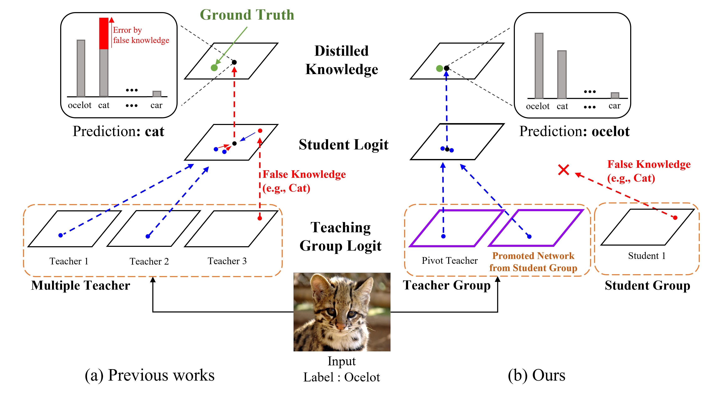

<div align="center">

## ORC: Network Group-based Knowledge Distillation using Online Role Change
  
[](https://arxiv.org/abs/2206.01186)

</div>

> **Network Group-based Knowledge Distillation using Online Role Change**<br>
> [Junyong Choi](https://github.com/choijunyong)(Hyundai Motor Company), Hyeon Cho(Ajou Univ), Seockhwa Jeong(Ajou Univ), Wonjun Hwang(Ajou Univ)<br>
> In ICCV 2023.<br><br/>
<div align=center></div><br/>

> **Abstract:** *In knowledge distillation, since a single, omnipotent teacher network cannot solve all problems, multiple teacher-based knowledge distillations have been studied recently. However, sometimes their improvements are not as good as expected because some immature teachers may transfer the false knowledge to the student. In this paper, to overcome this limitation and take the efficacy of the multiple networks, we divide the multiple networks into teacher and student groups, respectively. That is, the student group is a set of immature networks that require learning the teacher's knowledge, while the teacher group consists of the selected networks that have performed well. Furthermore, according to our online role change strategy, the top-ranked networks in the student group are able to promote to the teacher group at every iteration and vice versa. After training the teacher group using the error images of the student group to refine the teacher group's knowledge, we transfer the collective knowledge from the teacher group to the student group successfully. We verify the superiority of the proposed method on CIFAR-10 and CIFAR-100, which achieves high performance. We further show the generality of our method with various backbone architectures such as resent, wrn, vgg, mobilenet, and shufflenet.*

## Introduction


## Requirements
- Linux
- Python >= 3.7
- PyTorch == 1.7.1 
- CUDA (must be a version supported by the pytorch version)

## Getting Started
to be updated 
1. For ImageNet dataset <br>
Unzip the files and make the directory structures as follows.
```
data
 └ ImageNet
     └ train
     └ val
     └ test
```
#### Training process.
to be updated


## Results.
#### Top-1, Top-5 Error on ImageNet Val set 

|          | Top-1 | Top-5 |
|----------|---------|---------|
| ResNet18(baseline)|   30.25      |  10.93       |    
| ResNet18(Ours)|   28.00      |  9.13       |    

## Contact
For questions, please contact: chldusxkr1@gmail.com

## Citation
If you use this code in your research, please cite:
```bibtex  
@article{choi2023orc,
  title={Network Group-based Knowledge Distillation using Online Role Change},
  author={Choi, Junyong and Cho, Hyeon and Jeong, Seockhwa and Hwang, Wonjun},
  journal={IEEE International Conf. on Computer Vision},
  year={2023}
}
```
